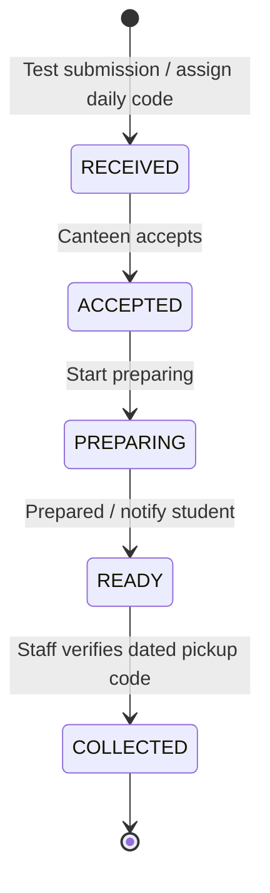

# Build BV — SpoonAte

SpoonAte is a food pre-ordering application for Banasthali Vidyapith. Students choose a canteen, add its items to a cart, select an estimated pickup time, and submit an order. Canteen members accept orders, prepare food, notify students, and verify pickup using the dated pickup code. Admins view campus-wide order activity and canteen summaries.

## Run the app

```bash
cd frontend
npm install
npm run dev
```

Open the URL printed by Vite. Run checks from `frontend`:

```bash
npm run test
npm run lint
npm run build
```

## Current implementation

The repository contains a React/Vite frontend with browser storage. Payment is disabled for testing. Submitting a test order generates a three-character alphanumeric pickup code unique across the campus for its allocation day (Asia/Kolkata), such as `AZ1` or `B7J`, and sends the order to the selected canteen for acceptance. This code is a test exception to the future payment sequence; no payment is collected or represented as paid.

Student accounts, carts, orders, and canteen availability are saved in `localStorage` and synchronize between tabs on the same browser and origin. Each tab keeps its own login in `sessionStorage`, so student and canteen sessions can be tested side by side. Different browsers/devices do not share these records. Earlier demo storage keys are retained but are not loaded by the new flows; sign up again to test the new account rules.

Authentication here is a frontend prototype: campus-domain validation does not verify email ownership. Canteen codes and the demo admin credentials are bundled client-side. A production backend must authenticate users, verify email ownership, hash and validate member codes, enforce ownership, and persist shared records before real use.

## Student signup and login

- Signup requires the student's name, password and an email ending exactly in `@banasthali.in`. The planned backend verifies that email with an OTP before account activation, then returns the student to login.
- Login requires the registered email and password. Email OTP is required at signup and password reset, rather than every student login. The prototype currently stores passwords in browser account records; production must store only server-side password hashes. Passwords are excluded from newly created session records.
- `@gmail.com`, subdomains, and look-alike domains are rejected. The requirement refers to the institutional email domain; a personal Gmail address is not accepted.
- Students see only their own carts, order history, and acceptance/readiness notifications.

## Banasthali canteen directory

| Canteen | ID | Current test member access code |
| --- | --- | --- |
| Mukteshwari's Canteen | `mukteshwari` | `Mukteshwari's Canteen` |
| Shanu's Canteen | `shanu` | `Shanu's Canteen` |
| Spicy Bites | `spicy-bites` | `Spicy Bites` |
| Annapurna Canteen | `annapurna` | `Annapurna Canteen` |
| Agarwal Canteen | `agarwal` | `Agarwal Canteen` |
| Fun 'N' Frolic | `fun-n-frolic` | `Fun 'N' Frolic` |
| Desi Jayka | `desi-jayka` | `Desi Jayka` |
| Bella Bite | `bella-bite` | `Bella Bite` |

Names are the supplied application directory. Locations, operating hours, menus, and prices have not been confirmed with individual canteens. Every canteen currently has a sample menu for testing, with separate item IDs. Directory and menu data are in `frontend/src/data/mockData.js`.

Canteen login requires a member email, the canteen represented, and that canteen's access code. Test codes match the names exactly, including capitalization and punctuation. The temporary mapping is in `frontend/src/data/canteenAccess.js`. Replace this lookup with manually entered, backend-managed database codes later; database storage is not implemented in this repository. Production canteen login also requires an OTP sent to the member email before establishing a session.

## Cart and order rules

1. A student's cart contains items from exactly one canteen. Adding another canteen's food is blocked with a message; empty the cart before switching.
2. Staff can pause/resume incoming orders for their canteen and pause/enable any individual menu item. Existing orders remain available for fulfillment.
3. Item and canteen availability are checked when adding food, increasing quantity, and submitting an order. Checkout uses the current menu price rather than a stored cart price.
4. Students select estimated pickup in 10, 20, 30, 45, or 60 minutes. The order stores an absolute pickup timestamp and a display time.
5. Prototype test submission creates a permanent UUID and a three-character uppercase alphanumeric pickup code on a `RECEIVED` order. Codes cannot repeat across any canteen during the same `Asia/Kolkata` calendar day, including collected orders. At campus midnight a new daily namespace becomes available without deleting history or expiring older orders. The limit is 46,656 allocations per day; exhaustion blocks new orders for that day. The prototype checks browser-local records using the device clock; server time and a PostgreSQL UNIQUE(code_day, code) constraint are required for shared concurrent allocation.
6. Student and canteen cards show the allocation day, pickup code, canteen, ordered items and quantities, pickup date/time in IST, and status. Canteen cards also show student name and order value; student history/details show order value where applicable.
7. Staff accept the order, start preparation, and mark it ready. Acceptance and readiness produce real in-app notifications from the order history.
8. When the student arrives, staff compare the day, canteen and items on the student’s dated order card with the selected order, then enter its code. Verification targets the permanent order UUID; a code alone cannot identify an order across days. Only a matching code on a ready order permits collection. The verifier and collection time are recorded.

The application has no order cancellation action or transition. There is no refund flow. Removing food from a cart before submission remains available. Estimated pickup is an arrival estimate, not an automatic expiry deadline.

## Order lifecycle



Only the owning canteen can advance its orders, one step at a time. Student and admin screens display progress without staff controls.

## Payment policy for a future release

Payment will be offered only after the canteen accepts an order. Before acceptance, the order uses an internal reference. After verified successful payment, assign the public three-character code within its reserved campus-day namespace and permit preparation. Retain the reservation day across midnight and payment retries. Accepted and paid orders have no cancellation or refund flow. No payment provider, payment screen, simulated paid state, or refund handling is part of the current test release.

## Admin

Select **Admin** on the login page. Test credentials: `admin@campuseats.com` / `admin123`.

The dashboard shows canteen availability, menu counts, total and active orders, collected order value, and searchable orders with canteen/status filters. Collected order value is the sum of test order prices, not payment revenue. Account approvals, code management, and payment management are future backend work.

## Test a complete order

1. Sign up as a student with a name, password and an `@banasthali.in` email, then log in using that email/password. Real email OTP is not connected in this prototype.
2. Open Bella Bite, add items, choose estimated pickup, and place a test order. Note the pickup code and allocation day.
3. Open a separate tab on the same Vite origin. Select **Canteen**, enter a member email, choose **Bella Bite**, and enter `Bella Bite` as the code.
4. Accept the order, start preparation, and mark it ready. The student's tracking and notifications update in the other tab.
5. Compare the student's dated card with the selected ready order, enter its pickup code and verify collection.
6. Pause incoming orders or a menu item and confirm that new additions/checkout are blocked. Existing orders can still progress.
7. Sign in another canteen member in a separate tab, check member emails/counts, remove their access and confirm the tab returns to login and cannot rejoin with the same code.
8. Log in as admin in another tab to review the order and canteen summaries.

See [architecture.md](architecture.md) for implementation boundaries, data models, routes, and the future backend sequence.

See [backend/backend.md](backend/backend.md) for the step-by-step backend implementation plan, database design, API contracts, and edge-case coverage.

## Canteen members and removal

The canteen dashboard lists browser-local members who have signed in using that canteen's access code. It shows emails, members with access, distinct people with valid sessions and session counts. Sessions count until logout or 12-hour expiry; this is not live online presence. OTP delivery and cross-device counts are planned backend work.

A canteen member can remove access for a member of the same canteen after confirmation. Removal retains the membership as revoked, ends that member's canteen sessions and blocks rejoining with the shared code. Other canteens and existing order history are unaffected. Admin-only restoration is planned. These prototype controls are not server security; the backend must enforce scope, revocation, expiry and audit records transactionally.

## Planned hosting and integration

Use Supabase-managed PostgreSQL with the TypeScript/Express/Zod/Prisma API and a durable outbox worker. The frontend calls Express, which enforces auth and business rules; database hosting alone does not implement them. Supabase Auth is a separate future decision. API/worker and frontend hosting providers remain to be selected; AWS is an available hosting option, not a required database change.

Track integration in [todo.md](todo.md) and capacity/recovery qualification in [scale.md](scale.md). Real signup/staff OTP delivery, password reset, database migrations, daily-code concurrency enforcement and cross-device synchronization are not implemented. The 30,000-user deployment remains unbenchmarked.

The product is named SpoonAte. Existing `campusEats*` browser keys and the demo admin email are retained for compatibility.
