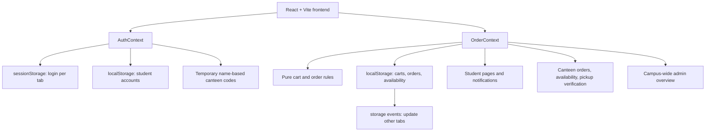
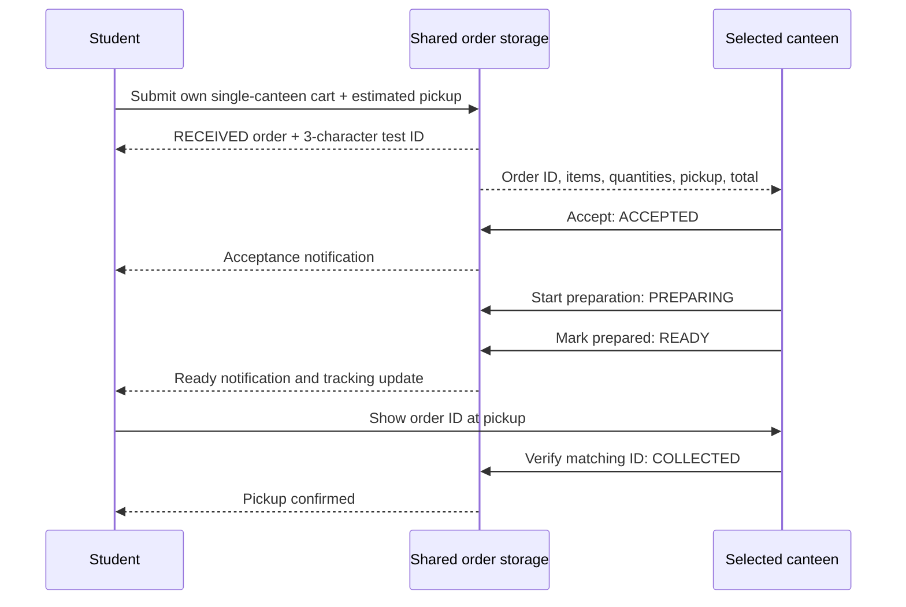
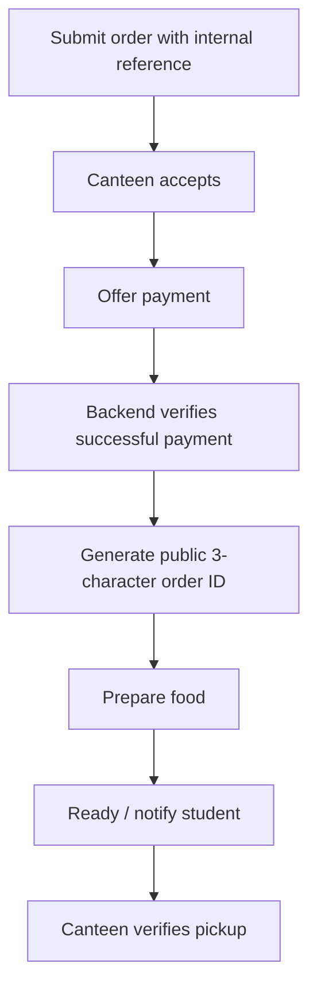

# Build BV — CampusEats architecture

The backend implementation roadmap is in [backend/backend.md](backend/backend.md). It describes planned work; this architecture documents the current frontend prototype.

## Implemented system



This repository currently has no backend API or database. Browser storage provides a same-browser test application. It does not provide production authentication, secure canteen membership, cross-device delivery, transactional updates, or payment processing. Simultaneous writes from multiple tabs use browser storage and can overwrite each other; a backend must provide transactional updates for production.

## Actual source structure

```text
Build_BV/
├── README.md
├── architecture.md
└── frontend/
    ├── package.json
    ├── vite.config.js
    ├── README.md
    ├── tests/orderRules.test.js
    └── src/
        ├── App.jsx
        ├── main.jsx
        ├── index.css
        ├── context/
        │   ├── AuthContext.jsx
        │   └── OrderContext.jsx
        ├── hooks/usePersistentState.js
        ├── utils/
        │   ├── authRules.js
        │   └── orderRules.js
        ├── data/
        │   ├── mockData.js
        │   └── canteenAccess.js
        └── pages/
            ├── Login.jsx
            ├── student/
            │   ├── StudentDashboard.jsx
            │   ├── CafePage.jsx
            │   ├── Cart.jsx
            │   ├── Checkout.jsx
            │   ├── OrderSuccess.jsx
            │   ├── MyOrders.jsx
            │   ├── OrderTracking.jsx
            │   ├── Notifications.jsx
            │   └── Profile.jsx
            ├── canteen/
            │   ├── CanteenDashboard.jsx
            │   ├── CanteenOrders.jsx
            │   ├── CanteenOrderDetails.jsx
            │   └── (unused screen stubs)
            └── admin/AdminDashboard.jsx
```

## Routes and ownership

| Route | Role | Behavior |
| --- | --- | --- |
| `/login` | Public | Student signup/email login, canteen membership login, admin login |
| `/student` | Student | Search the eight canteens and sample menus; view own active order |
| `/student/cafe/:cafeId` | Student | Browse one canteen's menu and availability |
| `/student/cart` | Student | Own single-canteen cart, quantities, removal, empty cart |
| `/student/checkout` | Student | Estimated pickup selection and test order submission |
| `/student/order-success?id=:id` | Student | Own submitted order and test ID |
| `/student/orders` | Student | Own active/completed orders |
| `/student/orders/:orderId` | Student | Own order progress |
| `/student/notifications` | Student | Own acceptance and readiness events |
| `/student/profile` | Student | Registered name and institutional email |
| `/canteen` | Canteen | Selected canteen's queue, acceptance, preparation, ready notification, availability, pickup |
| `/canteen/orders` | Canteen | Selected canteen's order history |
| `/canteen/orders/:orderId` | Canteen | Details and permitted status action for own order |
| `/admin/*` | Admin | Campus-wide overview and searchable orders |

`ProtectedRoute` reads the active auth context. `OrderContext` exposes only the student's orders/cart, the selected canteen's orders, or all orders for admin. Domain transition rules check staff role and canteen ownership again. Client-side checks are prototype behavior; the future API must repeat authorization for each request.

## Authentication

Student signup validates the exact `@banasthali.in` domain and a nonempty name, then saves a local account keyed by normalized email. Student login retrieves that registered account using email only. No password or role-only bypass exists for students. Email ownership is not yet verified; add an email-based verification/session flow on the backend without adding a student password requirement.

Canteen login requires a valid member email, selected canteen, and its matching code. The eight names are Mukteshwari's Canteen, Shanu's Canteen, Spicy Bites, Annapurna Canteen, Agarwal Canteen, Fun 'N' Frolic, Desi Jayka, and Bella Bite. Each current test code is exactly its canteen name. `canteenAccess.js` isolates this temporary mapping. Future manually supplied codes belong in the database, stored as hashes and checked by the backend; they must not be sent to clients.

Admin uses the existing demo email/password. Login is per-tab in `sessionStorage`, allowing separate student, canteen, and admin test tabs. The old demo login key is ignored.

## Storage model

| Key | Store | Contents |
| --- | --- | --- |
| `campusEatsSessionV2` | sessionStorage | Current tab's `{role, email, name, cafeId?}` or null |
| `campusEatsStudentsV2` | localStorage | Registered student profiles keyed by normalized email |
| `campusEatsCartsV2` | localStorage | Cart item arrays keyed by student email |
| `campusEatsOrdersV2` | localStorage | All test orders |
| `campusEatsAvailabilityV2` | localStorage | `{pausedCafes: [...ids], disabledFoods: [...ids]}` |

Versioned keys avoid interpreting legacy unowned demo orders as orders from the new account system. Existing old storage is not deleted. The persistence hook subscribes to browser storage events for other tabs and a custom event for same-tab writes. Mutation callbacks read the current stored value. Checkout reads current availability and cart data before building an order.

An order stores:

- `id`: three uppercase alphanumeric characters, unique across stored test orders.
- `studentEmail`, `studentName`: the placing student's account.
- `cafeId`, `cafeName`: the cart's canteen.
- `items`: snapshot of food ID, name, quantity, and current menu price.
- `total`: sum of current unit prices multiplied by quantities.
- `pickupAt`: ISO timestamp chosen relative to submission; `pickupTime`: display time.
- `createdAt`, `status`, `history`: creation and status change timestamps.
- `paymentStatus: NOT_REQUIRED_TEST`: no charge or simulated payment success.
- `pickupVerifiedBy`, `collectedAt`: added only after canteen verification.

`mockData.js` contains eight confirmed names and sample menus. Menu IDs are scoped to canteens. Exact locations, hours, menus, and prices await real canteen data.

## Student and canteen flow in testing



Allowed state progression is `RECEIVED → ACCEPTED → PREPARING → READY → COLLECTED`. Staff cannot skip states, reverse collection, or act for another canteen. Collection requires a matching ID on a ready order. No cancellation, rejection/refund, or automatic expiry state is implemented. A student's estimate does not invalidate an uncollected order.

Notifications are derived from persisted `ACCEPTED` and `READY` history events. They appear in-app and update other same-origin tabs. There is no email, push, or background notification service yet.

Availability is independent of order state. A canteen may pause all incoming orders or disable an individual menu item. These changes block new additions, quantity increases, and checkout; existing orders retain item snapshots and continue fulfillment. Cross-canteen cart additions are blocked without silently clearing the student's cart.

## Future backend and payment design

The future database should store users, canteens, member access code hashes, menu items and availability, orders, order items, and timestamped status events. Authorized operators will manually provision canteen codes in that database. The frontend will submit canteen selection and entered code to an authenticated membership endpoint instead of importing the mapping.

Backend order creation must validate ownership, one-canteen carts, availability, quantities, prices, and pickup time in a transaction. It must atomically reserve order IDs and enforce state transitions and pickup verification. Browser persistence can then be replaced with API calls and a server event or polling subscription.



Payment occurs only after acceptance. Preparation in the paid release is gated on verified payment, and the public ID is generated only after payment succeeds. The internal order reference must remain separate from the short pickup ID. No cancellation or refund flow is part of the specified product. This is a future design; the current frontend skips payment and generates the ID at test submission.

## Verification

`npm run test` runs Node tests for domain validation, signup/email-only login, membership codes, all eight canteens, single-canteen carts, availability checks, current-price totals, future pickup times, order IDs/collisions, ownership, valid transitions, and pickup verification. `npm run lint` checks frontend sources, and `npm run build` checks the complete module graph and production bundle.
