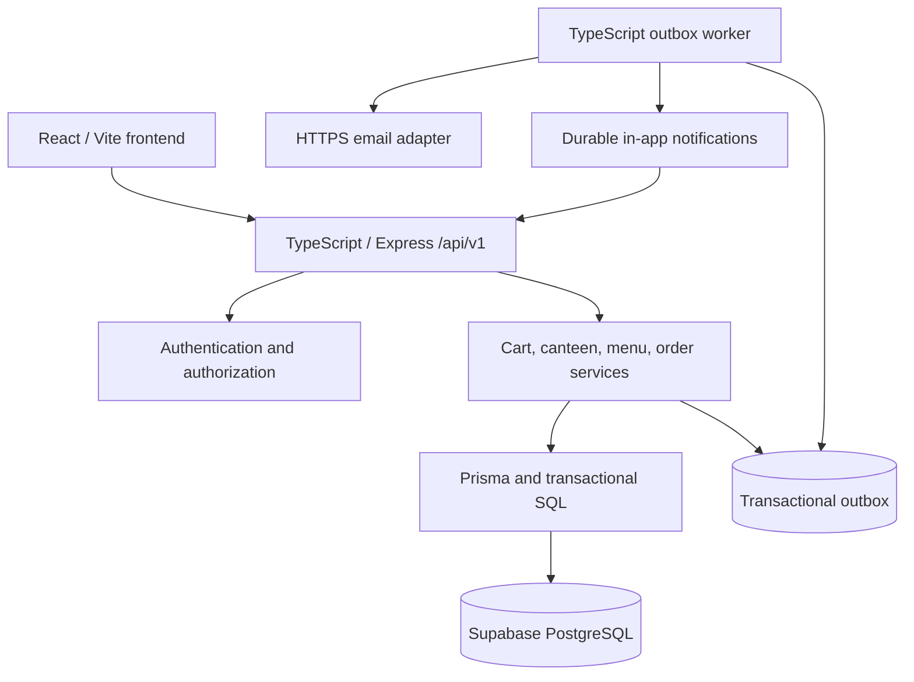
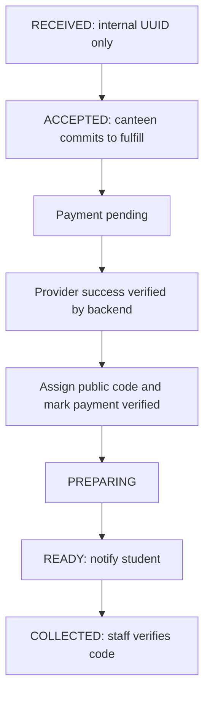

# Build BV backend implementation plan

Status: **planned, not implemented**. This document defines the backend work that will replace the frontend's browser storage. It follows the [project requirements](../README.md) and [current architecture](../architecture.md), including Bella Bite and the payment-free testing release.

## 1. Backend technology stack

The backend stack is **TypeScript + Node.js + Express + Zod + Prisma + PostgreSQL**. Use TypeScript strict mode, Express for HTTP routing, Zod for request/configuration validation and explicit response schemas, Prisma ORM and Prisma Migrate for persistence and migrations, and Supabase-managed PostgreSQL as the source of truth. React calls Express; Express and the outbox worker access the database through Prisma. Supabase Auth is not adopted in this plan; authentication remains in the application. Local development/tests may use PostgreSQL, with Supabase staging qualification before release. API/worker and frontend hosting remain to be selected; follow [scale.md](../scale.md) and the Supabase checklist in [todo.md](../todo.md). Use npm with a committed `package-lock.json`; select supported versions and pin them during Phase 1.

Keep dependencies minimal: runtime packages are `express`, `zod` and `@prisma/client`; development packages are `typescript`, `prisma`, `@types/node` and `@types/express`. Compile with `tsc` and run compiled JavaScript with Node.js. Use Node's built-in environment-file support, `crypto` (scrypt for password/access-code hashes, random session tokens and keyed OTP hashes), `fetch`, `node:test` and `node:assert`. Store sessions, rate-limit counters and outbox jobs in PostgreSQL through Prisma. Use Express's JSON parser, cookie response helpers and small application middleware for origin checks, CSRF, session lookup, rate limits, request IDs and redacted structured logs. Do not add packages for functionality already covered by this stack or Node.js.

Email verification requires a delivery service. Keep a small email adapter that calls the selected provider's HTTPS API with built-in `fetch`; use a fake adapter in automated tests. Select the provider before deploying authentication, without adding a mail SDK or custom SMTP implementation. Test APIs using `node:test` and `fetch` against an ephemeral Express server, and use real PostgreSQL for integration/concurrency checks. Verify browser acceptance flows with separate browser profiles; browser automation tooling is optional if later justified.

The existing frontend remains React (JavaScript/JSX), Vite, React Router, Tailwind CSS and Lucide React. Maintain the endpoint contracts in this document and validate frontend request/response fixtures with the backend Zod schemas; no API-documentation generator or frontend rewrite is required.

Start with one API codebase (the campus deployment uses at least two replicas as specified in scale.md) and a small TypeScript outbox-worker process sharing PostgreSQL. Use authenticated polling for cross-device updates. Add another library or infrastructure service only when a concrete requirement cannot be met cleanly with the chosen stack, and document the reason first.



Keep route handlers small. Services own business rules and transactions; repositories own persistence; response schemas select permitted fields. Use parameterized SQL within Prisma transactions where row locks or worker claims are required. The frontend never receives code hashes, OTP hashes, session secrets or another student's account data.

## 2. Planned folder structure

This is a planned structure; only the documentation is being updated now.

```text
backend/
  backend.md
  package.json
  package-lock.json
  tsconfig.json
  .env.example
  prisma/
    schema.prisma
    migrations/
    seed.ts
  src/
    app.ts                    # App factory; registers middleware/routes; testable without listening
    server.ts                 # HTTP process entry point
    config.ts                 # Validated environment configuration
    database.ts               # Shared Prisma client
    middleware/
      validate.ts             # Zod body, params and query validation
      origin.ts               # Allowlisted origins and credentialed preflight
      request-log.ts          # Request IDs and redacted structured logs
      auth.ts                 # Session, role and canteen scope checks
      csrf.ts
      rate-limit.ts
      errors.ts
    modules/
      auth/
      canteens/
      menu/
      cart/
      orders/
      notifications/
      admin/
      # Each module: routes.ts, schemas.ts, service.ts, repository.ts
    shared/
      errors.ts
      types.ts
      money.ts
      time.ts
    security/
      hashing.ts
      otp.ts
      sessions.ts
    adapters/
      email.ts
    workers/
      outbox-worker.ts
    cli/
      provision-canteen-code.ts
      provision-admin.ts
  tests/
    unit/
    integration/
    concurrency/
    contract/
    fixtures/

frontend/src/
  services/api.js             # Planned credentialed HTTP client
  services/adapters.js        # Planned API-to-existing-view-model mapping
  context/AuthContext.jsx     # Replace browser identity with API sessions
  context/OrderContext.jsx    # Replace browser records with server state
```

## 3. Endpoints synchronized with the frontend

The frontend currently has no HTTP API integration. The following contract maps its existing screens and context actions to the planned backend; it must be agreed before feature implementation. All routes below are relative to `/api/v1`, except `/health/live` and `/health/ready`. Register schemas and contract fixtures in Phase 1, then implement and connect each feature in its phase.

- `Login.jsx` / `AuthContext`: student signup sends `{ name, email, password }` and returns a signup email challenge. Persist only a salted password hash in pending state; never expose/log the password. Signup verification activates the account and returns the student to login without a session. Student login sends `{ email, password }` and creates a session only for an active verified account with a matching password hash. Canteen login maps `{ email, cafeId, secretCode }` to `{ email, canteenId, accessCode }` and returns a bound email challenge; verification creates the scoped staff session. Challenges return `{ challengeId, expiresAt, resendAfter }`, and verification sends `{ code }`. Password-reset request/verification uses a separate purpose-bound email challenge followed by a new password. Admin login sends `{ email, password }`. Add verification/reset UI and `GET /auth/csrf`, returning `{ csrfToken }` for an `X-CSRF-Token` header on writes.
- `StudentDashboard`, `CafePage`, and the login canteen selector use the directory/menu endpoints. API canteens expose UUID `id` plus stable `slug`; retain existing slug URLs such as `/student/cafe/bella-bite` by resolving the slug to the API UUID before requests. Menu responses expose `id`, `canteenId`, `name`, `description`, `category`, `pricePaise`, `available`, `archived` and `version`.
- `Cart` / `OrderContext`: `addToCart` sends `{ menuItemId, quantity, expectedVersion }`; quantity edits send `{ quantity, expectedVersion }`. Cart responses contain `{ id, canteenId, version, items, totalPaise, quoteToken }`, with line IDs, menu-item IDs and current prices/availability. Item mutation URLs use the cart-line ID, not the menu-item ID. A server-issued quote token binds the reviewed prices and cart version; validate it again during checkout.
- `Checkout` / `createOrder`: send `{ pickupAt, expectedCartVersion, quoteToken }` with an `Idempotency-Key`. Return the persisted order and clear the cart only after success. `OrderSuccess`, `MyOrders`, `OrderTracking` and canteen details use UUID `id` in routes and show `orderCode` for pickup. Order responses include `canteenId`, permitted student display details, immutable item snapshots, `orderCode`, `codeDay`, `status`, `totalPaise`, `pickupAt`, `version`, and status history; student email is not exposed in public catalog responses.
- `CanteenDashboard`, `CanteenOrders`, `CanteenOrderDetails` / `updateOrderStatus`: map `ACCEPTED`, `PREPARING`, `READY`, `COLLECTED` to `/accept`, `/prepare`, `/ready`, `/collect`. Send `{ expectedVersion }`; collection also sends `{ code }`. Reuse command idempotency keys on retries. `toggleOrders` sends `{ acceptingOrders, expectedVersion }`; `toggleFood` sends `{ available, expectedVersion }`, using explicit desired values rather than blind toggles.
- `CanteenDashboard` member management loads `GET /canteens/{id}/members`, mapping `canteenId` to prototype `cafeId` and valid session counts to `sessionCount`; response includes paginated `{ items, nextCursor }` plus `{ memberCount, signedInPeopleCount }` totals across the scoped list, not just the current page. Removal sends `{ expectedVersion }` to `POST /canteens/{id}/members/{memberId}/revoke`, then refreshes the list and session state. No access-code hash or secret is returned.
- `Notifications` loads durable notification records and marks them read; `Profile` uses `/auth/me`. `AdminDashboard` uses `/admin/overview` and `/admin/orders` for its existing summaries/search. MenuManagement, CanteenSettings and CanteenAnalytics files are not currently routed in `App.jsx`; connect their routes only when their corresponding UI work is implemented. Analytics can initially derive from scoped order lists; add a dedicated aggregate endpoint only if needed.

JSON fields use camelCase. Store/transport money as integer paise and format rupees in the frontend adapter. Transport timestamps as offset-aware ISO 8601 strings and display campus time. Map existing `cafeId` to API `canteenId`, `food.price` to `pricePaise / 100`, and permanent order UUID `id` separately from display `orderCode` and `codeDay`. Do not pass API UUIDs directly into slug comparisons. Lists return `{ items, nextCursor }` with bounded `limit`, stable cursor pagination and documented filters (`status`, `canteenId`, `search`, `from`, `to` where allowed); filters never widen the actor's scope.

Use `credentials: 'include'`, one configurable API base URL and a development Vite `/api` proxy. Poll active orders and notifications at a configurable interval (initially five seconds while the page is visible), refresh after mutations, and revalidate on focus/reconnect. Cancel polling on logout; show authentication/loading/error states instead of restoring authority from browser storage.

### Endpoint reference

All business endpoints use `/api/v1`. Public directory/login endpoints expose only the minimum data needed before login. Mutations require Zod-validated JSON bodies and bounded values; authenticated mutations also require CSRF protection under the cookie-session design.

| Method and route | Actor | Purpose |
| --- | --- | --- |
| `POST /auth/student/signup` | Public | Name/email/password signup verification challenge. |
| `POST /auth/student/login` | Public | Verify registered email/password and create session. |
| `POST /auth/student/password-reset`, `POST /auth/student/password-reset/complete` | Public | Purpose-bound email OTP request and atomic password replacement/session revocation. |
| `POST /auth/canteen/login` | Public | Email, selected canteen and code challenge. |
| `POST /auth/challenges/{id}/verify` | Public | Consume signup code and activate student account, or consume staff code and create scoped session. |
| `POST /auth/challenges/{id}/resend` | Public | Rate-limited replacement delivery. |
| `POST /auth/admin/login` | Public | Provisioned admin authentication. |
| `GET /auth/csrf` | Public/session | Bootstrap CSRF token for browser writes. |
| `GET /auth/me`, `POST /auth/logout` | Session | Restore identity / revoke current session. |
| `GET /canteens/{id}/members` | Own staff | Paginated member emails/status/session counts and aggregate members with access/distinct signed-in people. |
| `POST /canteens/{id}/members/{memberId}/revoke` | Own staff | Revoke own-canteen membership and all its sessions atomically; audit actor/time. |
| `GET /canteens`, `GET /canteens/{id}/menu` | Public/session | Safe directory and menu data. |
| `PATCH /canteens/{id}/availability` | Own staff | Pause/resume incoming orders. |
| `POST /canteens/{id}/menu`, `PATCH /menu-items/{id}` | Own staff | Menu creation, editing, availability or archive. |
| `GET /cart`, `POST /cart/items` | Student | Restore cart / add available item. |
| `PATCH /cart/items/{id}`, `DELETE /cart/items/{id}`, `DELETE /cart` | Student | Change quantity, remove item, empty cart. |
| `POST /orders` | Student | Transactional test submission with idempotency key. |
| `GET /orders`, `GET /orders/{id}` | Session | Scoped lists/details; server supplies role filters. |
| `POST /orders/{id}/accept`, `/prepare`, `/ready` | Own staff | Consecutive status commands. |
| `POST /orders/{id}/collect` | Own staff | Verify shown code and record pickup. |
| `GET /notifications`, `PATCH /notifications/{id}/read` | Student | Own durable notifications. |
| `GET /admin/overview`, `GET /admin/orders` | Admin | Aggregate reports and filtered order search. |
| `POST /admin/canteens/{id}/access-code` | Admin | Replace code through the audited hashing service. |
| `PATCH /admin/memberships/{id}`, `PATCH /admin/users/{id}` | Admin | Revoke or explicitly restore membership / manage account status; admin-only restoration never revives previously revoked sessions. |

Requests never accept authoritative student identity, arbitrary target status, trusted totals, or successful payment flags from the frontend. There are no cancel/refund endpoints.

Example error:

```json
{
  "error": {
    "code": "ITEM_UNAVAILABLE",
    "message": "An item is no longer available. Update your cart.",
    "details": { "itemIds": ["menu-item-uuid"] },
    "requestId": "request-uuid"
  }
}
```

Use `401` for missing/expired authentication, `403` for disallowed roles, `404` for absent/out-of-scope resources, `409` for state/version/idempotency/availability conflicts, `422` for invalid fields, `429` for rate limits, and `503` for temporary infrastructure failure. Return retry information where useful. Validation responses must not echo secret input.

## 4. Product rules to preserve

| Area | Required behavior |
| --- | --- |
| Student signup | Name, institutional email and password; verify email OTP before activation, then return to login. |
| Student login | Registered email/password for a verified active account; password reset uses email OTP. |
| Canteen login | Member email, selected canteen and member access code, followed by email OTP verification. |
| Member management | Own-canteen staff see member emails/access/session counts and may remove membership. Revocation ends scoped sessions and blocks rejoining until admin restoration. |
| Canteen codes | Manually provisioned in the database as hashes. Name-based codes are the temporary development values. |
| Cart | One canteen per student's cart; never silently discard another canteen's items. |
| Availability | Staff can pause new orders for their canteen or disable individual items. Existing orders can still be fulfilled. |
| Pickup estimate | Student chooses expected arrival; this is not an automatic expiry or collection deadline. |
| Test submission | No payment. Generate a three-character alphanumeric order code unique campus-wide for its allocation day and submit to the canteen. |
| Order progression | `RECEIVED → ACCEPTED → PREPARING → READY → COLLECTED`. |
| Notifications | Notify the student on acceptance and when the canteen marks food ready. |
| Pickup | Owning canteen verifies the code before marking a ready order collected. |
| Cancellation/refunds | No cancellation action, cancellation state, rejection/refund branch, or refund endpoint. Cart editing before submission remains allowed. |
| Admin | Authorized campus-wide oversight; staff controls remain scoped to their canteen. |
| Future payment | Offer payment only after canteen acceptance. Generate the public order code after verified payment and gate preparation on it. |

The current frontend is the behavior reference for testing, not a security boundary. Repeat ownership, validation, pricing, availability, and transition checks in the backend.

## 5. Database design

Use UUIDs for permanent internal identity. The short order code is a display/pickup value, not the primary key and not an authorization credential. Store timestamps in UTC, display pickup times in `Asia/Kolkata`, and store INR amounts as integer paise.

| Table | Main fields and constraints |
| --- | --- |
| `users` | UUID, normalized email with unique constraint, name, verified timestamp, account status, creation/update timestamps; nullable salted student password hash (required for activated student accounts). |
| `user_roles` | User ID, assigned role; unique user/role pair. Admin assignment comes only from an authorized provisioning action. |
| `canteens` | UUID, unique slug, name, confirmed location/hours when supplied, `accepting_orders`, operational status, version. |
| `canteen_access_codes` | Canteen ID, code hash, version, active flag, rotation metadata. Never store plain text. |
| `canteen_memberships` | User ID, canteen ID, active/revoked status, join timestamp, code version, revocation/restoration actor/time and version; unique user/canteen pair. Retain revoked rows to block rejoining. |
| `auth_challenges` | Opaque challenge ID, purpose, email, bound canteen where relevant, keyed OTP hash, expiry, attempts, consumed timestamp, challenge version and bound access-code version, signup name/pending salted password hash (never plaintext), and reset context. |
| `sessions` | Hashed random session token, user ID, selected role/canteen context and membership ID, creation/last-use timestamps, expiry, revocation state. Count distinct members with unexpired, unrevoked sessions; do not label that count online presence. |
| `carts` | One cart per student, selected canteen ID or null, version, update timestamp. |
| `cart_items` | Cart ID, menu item ID, positive quantity; unique cart/item pair. Enforce item/canteen consistency in service transactions and relational constraints. |
| `menu_items` | UUID, owning canteen ID, name, description, category, price in paise, availability, archived flag, version, optional image reference. |
| `orders` | UUID, student ID, canteen ID, status, execution mode, payment status, total paise, pickup timestamp, nullable public code, immutable campus allocation day (`code_day`, Asia/Kolkata), version, timestamps. |
| `order_items` | Order ID plus immutable item-name, quantity, and unit-price snapshots; retain history when a menu item is archived. |
| `order_events` | UUID, order ID, previous/new status, actor ID, time; created with the status update. |
| `order_code_allocations` | Three-character uppercase code, immutable `code_day` (Asia/Kolkata), owning order UUID, allocation time. Enforce `UNIQUE(code_day, code)` across all canteens and statuses; retain allocations and history permanently. Do not release collected-order codes during their allocation day. |
| `notifications` | Recipient user ID, source event ID, order ID, type, message, created/read timestamps; unique recipient/source-event/type. |
| `outbox_events` | Event ID, payload reference, processing state, attempts, available-at time, worker lease, last error. |
| `idempotency_keys` | Actor ID, route/action, key, request hash, completion state, durable response/order reference; unique actor/action/key. |
| `audit_logs` | Actor, action, target, before/after metadata without secrets, timestamp and request ID. |

Add indexes for student/order date, canteen/status/pickup time, unread notifications, active sessions, pending outbox work, and idempotency lookup. Foreign keys protect referenced accounts/canteens. Archive entities with order history rather than deleting their records.

Use one shared Prisma client per process and disconnect it on graceful shutdown. Keep Prisma model fields camelCase with explicit database table/column mappings where snake_case is used. Separate migrations from application startup. Test migration application on an empty database and on existing schema fixtures. Seed commands must be repeatable without overwriting manually configured codes, menus, or availability.

## 6. Phase-by-phase implementation

Execute phases in order. Every phase includes implementation tasks and a completion gate below; record its status and verification evidence before advancing. Integrate the relevant frontend action as its backend feature becomes available; Phase 12 completes the full cutover.

- Phase 1: foundation and API contracts; no prerequisites.
- Phase 2: schema, migrations and provisioning; depends on Phase 1.
- Phase 3: student authentication; depends on Phases 1-2.
- Phase 4: staff/admin authorization; depends on Phases 2-3.
- Phase 5: directory, menus and availability; depends on Phases 2-4.
- Phase 6: server carts; depends on Phases 3 and 5.
- Phase 7: transactional test orders; depends on Phases 4-6.
- Phase 8: fulfillment transitions; depends on Phase 7.
- Phase 9: notifications and synchronization; depends on Phase 8 and the outbox schema.
- Phase 10: verified collection; depends on Phases 8-9.
- Phase 11: admin oversight; depends on Phases 4-10.
- Phase 12: frontend cutover and contract verification; depends on Phases 3-11.
- Phase 13: staging, recovery and release; depends on Phase 12 and the coverage checklist.
- Future payment phase: separate work after payment-free release acceptance.

### Phase 1 — Bootstrap the API and configuration

1. Create the strict TypeScript project, npm lockfile, Express app factory, Prisma client, and validated configuration loader. Add development, build, start, worker, migrate, seed and test scripts. Define Zod request/response schemas, endpoint contracts and frontend fixtures before implementing feature handlers. Export an Express app factory and keep listening/shutdown logic in server.ts. Mount module Express Routers under /api/v1, validate bodies/params/query values with Zod, and register the error middleware last.
2. Add `/health/live` and `/health/ready`; readiness checks PostgreSQL with a short timeout. Keep these responses free of secrets.
3. Configure a local PostgreSQL instance and separate test database. Add explicit frontend origin configuration or a Vite `/api` proxy for development.
4. Define `APP_ENV`, server-only application `DATABASE_URL`, separate migration connection configuration, `FRONTEND_ORIGIN`, `ORDER_MODE=TEST`, email-provider settings, session/OTP secrets and lifetimes, request limits, and logging configuration in `.env.example` using placeholders.
5. Validate that production cannot enable name-based seed codes or bypass email verification. Keep payment routes absent in the first release.
6. Add request IDs, structured logs, a stable error envelope, and a shared exception mapper.

**Complete when:** the API boots with valid configuration, invalid configuration fails clearly, health checks distinguish API health from database readiness, and logs contain no credentials.

### Phase 2 — Create migrations and provision the canteen directory

1. Define the initial models and relations in prisma/schema.prisma, then generate Prisma migrations for the tables, constraints and indexes in section 5. Add SQL to migrations for constraints Prisma cannot express. Use Prisma Migrate for local development and apply committed migrations during deployment; do not use schema push as the release migration strategy.
2. Configure Supabase staging/production PostgreSQL credentials, TLS, application/migration roles and supported Prisma pooling. Keep browser access to application tables disabled; qualify interactive transactions and migration connectivity before deployment. Seed the eight canteens below using stable slugs that match the frontend.
3. Add an operator CLI that prompts for a canteen code without echoing it, hashes it with salted Node.js crypto.scrypt, and writes the hash/version transactionally. Operators can manually provision codes without entering plain text in database SQL or logs.
4. Permit name-based codes only for explicitly configured development seed data. Require operators to supply production codes; never overwrite existing manually entered hashes on reseeding.
5. Seed sample menus only in development. Real menu prices, locations, and hours must come from canteen-supplied data.
6. Add a separate admin provisioning command; do not ship the frontend's `admin123` credential as a production account.

| Slug | Name / temporary development code |
| --- | --- |
| `mukteshwari` | Mukteshwari's Canteen |
| `shanu` | Shanu's Canteen |
| `spicy-bites` | Spicy Bites |
| `annapurna` | Annapurna Canteen |
| `agarwal` | Agarwal Canteen |
| `fun-n-frolic` | Fun 'N' Frolic |
| `desi-jayka` | Desi Jayka |
| `bella-bite` | Bella Bite |

**Complete when:** migration and seed tests pass, the eight names are returned correctly, codes are hashed, and catalog responses never reveal them.

### Phase 3 — Implement student signup verification and email/password login

1. Signup accepts `name`, `email` and `password`. Normalize the exact institutional email domain and validate bounded name/password inputs. Hash the password with salted Node.js `crypto.scrypt`; never persist/log the plaintext or return hashes in API responses.
2. Issue a purpose-bound signup OTP to that email. Persist only a keyed OTP hash, pending password hash/name, expiry and attempt counters. Proposed defaults: 10-minute expiry, 5 attempts and 60-second resend interval.
3. Return an opaque challenge ID. Only successful OTP verification activates the account and writes the password hash. A unique normalized-email constraint handles concurrent signup. Signup verification returns to login without creating a session.
4. Login accepts registered `email` and `password`. Verify the salted hash and active/verified account state server-side, using constant-time hash comparison. Return a uniform invalid-credentials response and rate-limit attempts. Login does not send an OTP on every attempt.
5. Consume OTPs atomically and reject replay, expiry, wrong purpose/email and exhausted attempts. Resending replaces the active challenge version; delayed old deliveries cannot authorize verification.
6. Add purpose-bound password-reset request and completion endpoints. Atomically verify/consume the reset OTP, hash the replacement password and revoke existing student sessions. Use uniform reset-request responses for unknown addresses.
7. Use shared rate limits and hashed opaque cookie sessions; implement `/auth/me`, logout, expiry and revocation. Never return passwords or password hashes to frontend session records.
8. Development may use a local test inbox; production must block verification bypasses and returned OTPs. Do not migrate prototype plaintext browser passwords into production.

**Complete when:** institutional signup requires email ownership, unverified users cannot log in, correct email/password works, wrong password fails uniformly, reset revokes sessions, concurrent signup and OTP expiry/replay/delivery-failure tests pass.

### Phase 4 — Implement canteen membership and admin authorization

1. Canteen login accepts member email, selected canteen UUID, and access code. Verify email ownership through a bound email challenge as well as checking that canteen's code hash.
2. Check the code when starting the challenge and recheck its active version at completion, so a rotated code cannot finish an older challenge.
3. On successful verification, establish the member account/membership and a session bound to the selected canteen. Check for a retained revoked membership both when starting and completing the challenge; a valid shared code never restores revoked access. Knowing one canteen's code grants no access to another.
4. Check account status, active membership, selected canteen and code version on each staff request. Proposed rotation behavior: require reauthentication with the new code; preserve membership records but invalidate sessions authorized under the old version.
5. Add admin authentication and server-assigned permissions. Client-submitted roles cannot create an admin or elevate a student session.
6. Add own-canteen staff member listing and removal plus audited operator/admin account disabling, membership restoration and code rotation. Staff may list/remove only members of their selected canteen; client-submitted canteen IDs never widen scope. Listing shows permitted member emails, access status, per-member valid session counts and aggregate distinct signed-in people/members with access. Count only unexpired, unrevoked sessions for active memberships; this is not online presence. Removal atomically revokes membership, revokes all sessions in that canteen and records actor/time. Reject new login or pending OTP completion for a revoked member until an admin explicitly restores membership. Keep unrelated memberships and order history intact; serialize login/verification against removal so a race cannot create a surviving session. A shared code permits joining as a member; individual member approval is not required by the current product rules.
7. Implement a common ownership dependency used by every order, menu, availability and notification endpoint. Return `404` for object IDs outside the actor's scope, avoiding object-existence disclosure.

**Session design:** use random opaque tokens in `HttpOnly` cookies, with `Secure` in production, appropriate SameSite configuration, and CSRF protection for state-changing requests. Allowlist origins for credentialed requests. Cookies are shared across tabs, unlike the current frontend's per-tab sessions: test different roles using separate browser profiles. Never treat a `sessionStorage` role or submitted canteen ID as authorization.

Apply origin/CSRF checks to login and verification as well as authenticated writes to prevent login-session substitution. Persist only session-token hashes, rotate tokens on authentication/context changes, and revoke them on logout. Proposed configurable defaults are a 12-hour absolute session lifetime and a 30-minute idle timeout.

**Complete when:** wrong-code/selected-canteen cases, revoked memberships, code rotation, forged roles, expired sessions, CSRF and cross-canteen access tests pass.

### Phase 5 — Implement the catalog, menus and staff availability

1. Expose the canteen directory and menu responses with stable IDs, names, status, prices and item availability. The login selector needs only public canteen names/IDs, not member records.
2. Staff may create/edit/archive items only for the selected canteen. Validate names, bounded positive prices, quantities where supported, categories and image references; never accept arbitrary server-side image-fetch URLs.
3. Add explicit `accepting_orders` and item-availability update endpoints. Use a row version or `If-Match` equivalent to detect stale edits.
4. Maintain immutable order snapshots when menu names/prices change or items are archived.
5. Apply availability immediately to new cart additions and submission. Pausing does not delete carts, hide existing orders, reverse acceptance, or disable preparation/pickup.
6. Return a specific reason for ordering being paused versus an individual item being unavailable. Unknown operating hours must not be treated as confirmed campus hours.

**Complete when:** own-canteen controls work; unauthorized changes and stale updates fail; historical orders retain original item details.

### Phase 6 — Implement persistent single-canteen carts

1. Load carts by authenticated student ID; never by an arbitrary email from the request body.
2. Lock the student's cart during writes. The first added item sets the canteen. All later items must belong to it.
3. Reject cross-canteen additions with `409 CART_CANTEEN_CONFLICT` and retain the existing cart.
4. Validate menu existence, positive integer quantities, proposed configurable item/quantity limits, current canteen status and item availability when adding/increasing quantities.
5. Allow reduction/removal of an unavailable item and explicit empty-cart actions. Clear the canteen binding when the final item is removed.
6. Calculate displayed totals from server menu prices. Return cart version and current availability/price information; clients cannot set trusted unit prices or totals.
7. Include a cart version in checkout. Reject changed-price or changed-cart versions with the updated summary so the student can review and resubmit.

**Complete when:** two devices cannot create a mixed cart, a new login restores the cart, quantity limits work, and disabled items can be removed without permitting checkout.

### Phase 7 — Implement transactional test-order submission

`POST /orders` accepts estimated pickup, expected cart version/quote, and an `Idempotency-Key`. Student ID, canteen, menu prices, status and payment status are server-derived.

1. Validate an offset-aware pickup timestamp in the future using server time. Support the UI's 10/20/30/45/60-minute choices; proposed configurable maximum horizon is 60 minutes. Invalid/missing timestamps are rejected.
2. Claim the idempotency key for this actor/action and request hash. Repeated identical requests return the original order even after the cart is cleared; the same key with different input returns a conflict.
   Bound key length and retain the completed order-creation mapping for the order's lifetime. Cleanup must not remove the deduplication guarantee for delayed retries; failed rolled-back attempts may be safely retried.
3. In a transaction, lock the cart, relevant canteen and menu records, then recheck ownership, one-canteen contents, availability, quantities, current prices and expected version.
4. Acquire locks in one documented order across cart, availability and checkout operations, and retry bounded deadlock/serialization conflicts. Pausing and submitting must have a defined winner: a committed pause blocks a later submission; a committed order remains valid after a later pause.
5. Derive the campus allocation day from server time in `Asia/Kolkata`, then generate and reserve a three-character uppercase alphanumeric code unique within that day across all canteens. Use cryptographic randomness plus a database unique constraint; handle collisions with a bounded retry/savepoint and a controlled fallback search, not a read-then-write uniqueness check alone.
6. Insert the order with `RECEIVED`, `execution_mode=TEST`, `payment_status=NOT_REQUIRED_TEST`, immutable item snapshots, UTC pickup time, and initial history event.
7. Clear the cart, complete the idempotency record, and create the canteen update/outbox event in the same transaction. Commit all of these together.
8. Return the order UUID, public code, summary and status. If the network loses the response, retry with the same key; if the transaction fails, preserve the cart and return a retryable error.

For coordinated availability checks and transitions, implement explicit row locks or conditional version updates inside the transaction. PostgreSQL's row-lock behavior is described in its [explicit locking documentation](https://www.postgresql.org/docs/current/explicit-locking.html).

**Code-space policy (approved):** three base-36 characters provide 46,656 allocations per campus calendar day, with `UNIQUE(code_day, code)` enforcing no same-day repetition across any canteen or status. Midnight in `Asia/Kolkata` opens a new namespace logically; do not delete old allocations, clear history, or expire uncollected orders. Persist the day once and never reassign it on retries. Exhaustion blocks that day's new allocations with `ORDER_CODE_CAPACITY_EXHAUSTED`. UUIDs remain permanent route/command identities. Order cards show allocation day, ordered items, code and canteen. Staff compare the student's dated card with the UUID-selected order before collection; any pickup lookup by code must also require its allocation day and owning canteen. Admin report searches may return multiple dated rows across canteens; collection always targets a scoped UUID. Older ready orders can still be collected after midnight.

**Complete when:** simultaneous submissions produce one order per idempotency key, unique codes, consistent totals, and no partial order/cart updates; availability races and namespace exhaustion pass integration tests.

### Phase 8 — Implement acceptance and preparation

1. Provide staff commands for accept, start preparation and mark ready. Accept only an existing `RECEIVED` order owned by the active canteen.
2. Lock the order or condition the update on current status/version. Permit only the next transition; a stale dashboard gets `409 ORDER_STATE_CONFLICT` and refreshes.
3. For an exact replay of the same command/key, return its recorded response without creating duplicate events. Do not make arbitrary later-state commands appear successful.
4. Write the new status, timestamp, actor, history and notification outbox record in the same transaction.
5. Keep all submitted and accepted orders visible if incoming orders are later paused or an item becomes unavailable.
6. Do not add rejection, cancellation, expiry or refund transitions. A received order remains awaiting acceptance until acted on; a delayed/uncollected order remains visible for follow-up.

**Complete when:** two staff members cannot double-advance an order, preparation cannot precede acceptance, and paused canteens can fulfill existing orders.

### Phase 9 — Implement notifications and cross-device updates

1. Persist acceptance and ready notifications addressed to the owning student. Do not infer delivery from a browser alert or return an invented sample notification.
2. Process outbox entries after transaction commit. Workers use leases/row claims, retry transient failures with backoff, and record persistent failures for operator retry.
3. Enforce a unique notification/event key, so worker retries cannot duplicate messages. Order transitions remain committed even if delivery temporarily fails.
4. Expose paginated notifications and idempotent mark-read actions, scoped to the authenticated user.
5. Begin with authenticated polling for orders/notifications. Optionally add an event stream with event IDs, reconnect cursors, heartbeats, and scoped delivery; missed events trigger a normal state refresh.
6. A student who was offline sees the durable ready message on the next login. Stop authenticated polling on session expiry; resume it after successful login. If event streams are added later, apply the same session checks to them.
7. Keep signup, canteen-login and password-reset email delivery distinct from in-app order notifications. Email/push order alerts are optional later adapters, not assumed available in this release.

**Complete when:** restarting workers loses no ready event; offline/reconnecting clients recover; student A cannot read student B's notifications.

### Phase 10 — Implement staff pickup verification

1. Staff compare allocation day, canteen and items on the student’s dated card, select that order by UUID, then submit the three-character code presented by the student to `POST /orders/{order_id}/collect`.
2. Require the selected canteen's active membership, `READY` status, expected version, and matching normalized code. Code knowledge alone never authorizes collection or order lookup.
3. Rate-limit failed attempts and return a clear mismatch error without advancing the order.
4. Atomically record `COLLECTED`, verifier ID, collection timestamp and event. A repeated successful command/key returns its original result; a different duplicate handover request reports the order already collected.
5. Retain the order history. Never permit collection of a received/preparing order or reverse a completed pickup.

**Complete when:** wrong, missing and malformed codes fail; code-only lookup is forbidden and identical codes on different days target separate UUIDs; concurrent verification records one handover and one collection event.

### Phase 11 — Implement admin oversight

1. Aggregate campus-wide canteen counts, active/total/collected orders, and collected test order value with clearly named metrics.
2. Add paginated search/filtering by canteen, status, code and date range. Sorting should be stable using timestamp plus UUID; canteen queues use pickup time plus creation time.
3. Permit authorized admin directory/menu/member/code maintenance with audit records. Code changes use the provisioning service; hashes are never returned.
4. Disable accounts/canteens for new access/orders without deleting existing order history or exposing secret data in exports.
5. Keep staff acceptance/collection scoped to staff permissions. Any future admin fulfillment override needs a separately designed action and audit trail.

**Complete when:** admin metrics match stored orders, test order value is never labeled paid revenue, and student/canteen sessions cannot access admin endpoints.

### Phase 12 — Connect the existing frontend

1. Add `frontend/src/services/api.js` with credentialed requests, request IDs, error parsing and a single API base path.
2. Replace `AuthContext` browser identity lookup with backend login challenges, verification, `/auth/me`, session restoration and logout. Add the email-verification screen; keep student signup name/email/password with email OTP activation, subsequent email/password login, and canteen email OTP login.
3. Connect the canteen member panel to scoped listing/removal APIs; show member emails and distinct valid-session counts, confirm removal and refresh/revalidate sessions on revocation. Replace the frontend-imported code mapping with selected-canteen/code submission. Remove bundled test admin secrets when backend auth is active.
4. Replace `OrderContext` local persistence with server carts, orders, availability and notifications; refresh relevant state after mutations and on reconnect.
5. Treat backend UUID as internal `id` and display `orderCode` as the three-character code. Update student success/tracking links, canteen details, collection input and admin search accordingly. Never use an ambiguous short code as the sole route identity.
6. Convert integer paise to rupee display values. Send offset-aware timestamps, render in campus time, and keep arrival estimates distinct from deadlines.
7. Disable duplicate-submit buttons while pending and reuse the original idempotency key on retries. Show actionable availability, cart-version and transition-conflict errors.
8. Do not automatically import local demo accounts, codes or orders into the database. They are unverified client input. Seed a known development database and let users create verified accounts.
9. Once backend mode is active, never silently fall back to local writes during an outage. Show a retry state and preserve an unsent cart draft only if clearly labeled as unsynchronized.
10. Retain a clearly separated frontend demo mode only if needed; it must not mix records with API mode.

**Complete when:** student/canteen/admin flows work across separate devices, refresh restores backend state, and modifying localStorage no longer changes identity or order authorization.

### Phase 13 — Test, deploy and operate the payment-free release

1. Compile TypeScript and run node:test with node:assert for pure rules, Zod contracts, API/authorization checks and PostgreSQL integration tests. Start the Express app on an ephemeral port and use built-in fetch for HTTP assertions; close the server and Prisma client after each test suite.
2. Run concurrency tests with separate connections/processes; mocks or SQLite alone do not prove PostgreSQL locking/uniqueness behavior.
3. Verify browser workflows across separate student, owning-canteen, other-canteen and admin profiles. Cover session restoration, network retries and offline recovery. Record manual acceptance evidence; add browser automation only when its maintenance benefit justifies an additional tool.
4. Deploy Supabase PostgreSQL projects and migrations plus separately hosted API and outbox worker to staging. Configure HTTPS, explicit CORS/CSRF, secrets, bounded request sizes/timeouts and shared rate limits.
5. Test backups and restoration. Monitor failed logins, API errors, database lock latency, outbox backlog, stuck received/ready orders and remaining code capacity without logging OTPs or member codes.
6. Verify process restart recovery, duplicate request handling, email-provider failure and database-unavailable behavior. Define a rollback procedure compatible with the applied schema.
7. Release in `TEST` mode with payment integrations disabled. Make no paid-revenue claims.

**Complete when:** the coverage matrix below passes, staging acceptance is documented, and operators can restore data and retry failed outbox work.

## 7. Future payment phase — separate from the first release

Implement this only after the payment-free backend is accepted. Provider choice and provider-specific behavior require a separate integration plan.



Keep fulfillment and payment statuses separate. Production orders before payment have an internal UUID and no displayed pickup code; canteen cards use an incoming-order reference until the code exists. Existing test orders keep their original execution mode and are never retroactively treated as paid.

1. Add payment attempts, provider-event deduplication, verified payment references, and reconciliation records through new migrations.
2. Allow payment initiation only for the owning student's accepted order. Derive amount from immutable order snapshots. One unresolved active attempt must not be followed by another attempt that could double-charge.
3. Account for finite code capacity before initiating payment. Reserve allocation capacity transactionally for an immutable campus day before initiating payment, without exposing/assigning the public code before payment success. Keep that reservation day across midnight and pending-payment reconciliation; display it on the order card after success. Consume that reservation and assign the unique code after verified success. Release reservations only when the provider confirms no charge can still succeed.
4. Use the provider's idempotency mechanism and stable internal order reference. A frontend redirect, screenshot or submitted success flag never marks an order paid.
5. Verify webhook authenticity, amount, currency, order reference and provider payment ID before committing success. Record verified success, public code and event/outbox atomically; retries resume an interrupted local commit.
6. Failed payments leave the accepted order unprepared and allow a controlled retry only after the prior attempt is definitively resolved. Pending/unknown results require reconciliation, not an assumed failure or a second charge.
7. Duplicate or out-of-order webhooks cannot regress a verified payment or duplicate preparation. Reconcile missed events with the provider.
8. Continue accepted orders if the canteen pauses new orders. Menu-price changes do not change the amount of an already submitted order.
9. Keep the specified absence of order cancellation/refund APIs. Delayed payment or missed pickup does not silently cancel, expire or refund an order.
10. Before enabling live charges, resolve operational exceptions: a canteen unable to fulfill after accepting, unexpectedly duplicated charges, disputes/provider reversals, indefinitely pending attempts, and abandoned accepted orders. The current requirements do not define these outcomes. Document the agreed handling instead of inventing an automatic refund, rejection or expiry branch. Payment launch depends on those decisions; the testing backend does not.

## 8. Coverage matrix

Use this as the implementation acceptance checklist. Each row needs automated verification where possible; operational recovery rows also need staging exercises.

| Case | Expected result / test |
| --- | --- |
| Valid institutional signup | Verified account created with supplied name, unique normalized email. |
| Personal Gmail, subdomain, look-alike, malformed email | Rejected; exact institutional domain required. |
| Blank/oversized name, duplicate signup, simultaneous signup | Validation or safe existing-account response; one account only. |
| Unknown student email, wrong password, unverified/disabled account | Uniform invalid-credentials response; no authenticated session. |
| Student signup verification and password reset | Signup activates only after OTP; reset code is purpose-bound/single-use and password replacement revokes existing sessions. |
| Canteen member listing, removal and rejoining | Own-canteen emails/counts only; all target scoped sessions revoked, login and pending OTP completion blocked until admin restoration, unrelated canteens/history preserved. |
| Wrong/expired/reused OTP, wrong purpose/challenge | Rejected; attempts/rate limits enforced; no session. |
| OTP resend, resend race, email delivery failure | Defined replacement behavior; older code invalid; retryable delivery state. |
| Forged role, session expiry/revocation, disabled user | Authorization fails; client storage cannot restore privileges. |
| Missing canteen, incorrect code, another canteen's code | No membership/session for selected canteen. |
| Code rotates while login is pending or session active | Old challenge/session cannot authorize staff mutations. |
| Revoked member or another canteen's order/menu | No access or update; no leaked object details. |
| Empty cart, missing/archived item | Submission rejected; no order created. |
| Mixed canteens, two-device additions | Conflict; original cart retained. |
| Zero, negative, fractional, excessive quantity | Rejected by request/service/database validation. |
| Paused canteen or disabled item | Add/increase/checkout blocked; removal still available. |
| Price, availability or cart changes before checkout | Updated summary/conflict; no stale trusted total. |
| Concurrent pause and submission | Serialized outcome; committed orders remain fulfillable. |
| Past/invalid pickup, absent offset, excessive horizon | Rejected; campus timezone display tested. |
| Pickup estimate passes / student arrives late | No automatic expiry; staff still see active order. |
| Double click, lost response, retried request | Same idempotency key returns the same order. |
| Reused key with different payload | Conflict; no second order. |
| Code collision, concurrent allocation, daily capacity exhaustion | Unique `(code_day, code)` or controlled failure; no overwritten order. |
| Campus midnight, repeated historical codes, collected orders, late pickup | New day permits reuse; same-day reuse stays blocked across canteens/statuses; UUID routes and notifications stay distinct; older ready orders remain collectible. |
| DB error midway through submission | Entire transaction rolls back; cart remains. |
| Staff skip/reverse state, concurrent updates | Invalid/conflicting command; one valid transition/event. |
| Pause/item disable after submission | Existing accepted/ready orders retain snapshots and progress. |
| Acceptance/ready event with worker crash | Durable retry; at most one user notification per source event. |
| Student offline / missed update / polling reconnect | Reload recovers current status and notification history. |
| Other student's notifications/order ID | No disclosure; code knowledge is not authentication. |
| Wrong/missing/malformed pickup code | No collection; bounded attempts and clear error. |
| Same code on different dates | Staff compare dated card with the UUID-selected order; code knowledge alone cannot resolve which historical order to collect. |
| Pickup before ready / two staff verify together | Reject early pickup; record one collection only. |
| Admin totals/search/date filter/pagination | Stable results; test order value distinct from revenue. |
| Secret fields in API/log/error/export | Not exposed; automated response/log checks. |
| CSRF, disallowed origin, unbounded query/body | Request rejected or safely bounded. |
| Database/API/email outage and process restart | Clear failure; no partial writes, fake success or lost durable work. |
| Backup restoration / migration failure | Tested restore/rollback procedure; readable historical orders. |
| Payment requested in test mode | Unavailable; no provider charge or paid status. |
| Future payment before acceptance / frontend fake success | Rejected; server state and provider verification required. |
| Future duplicate/delayed/missed payment events | Deduplicated/reconciled without double charges or status regression. |
| Future payment succeeded but code/DB write failed | Reserved capacity retained; reconciliation completes durable code assignment. |
| Future accepted order never paid or fulfillment becomes impossible | Preparation blocked; operational outcome requires the documented product decision above. |

## 9. Completion criteria and build order

Implement phases 1–4 before accepting authenticated requests, phases 5–7 before placing real persisted test orders, phases 8–10 before canteen fulfillment testing, and phases 11–13 before replacing the frontend demo storage in a deployed environment. Implement the payment phase separately.

The payment-free backend is complete when all eight canteens can use database-managed member codes, verified students can order from one canteen, availability is enforced transactionally, staff can accept/prepare/notify/verify pickup, admins can inspect scoped reports, retries do not create duplicates, and cross-device browser tests pass. Update this plan, the README and architecture together when a phase changes from planned to implemented.
