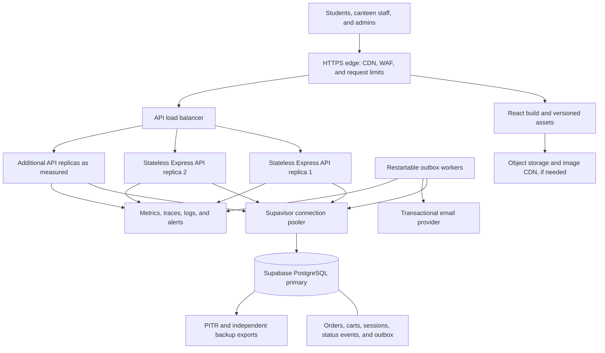
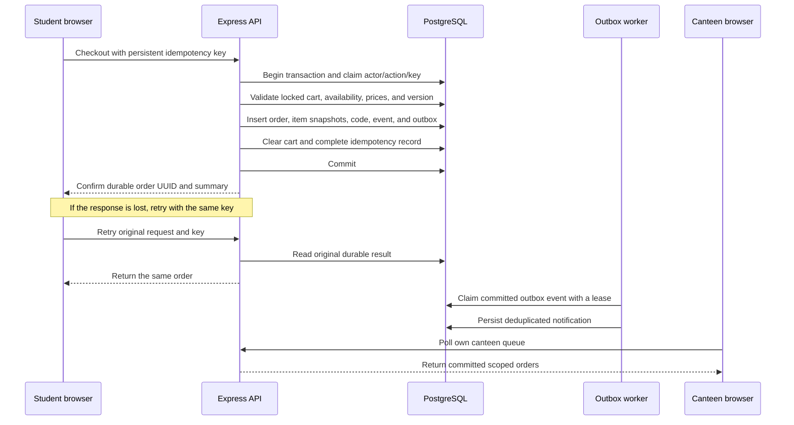
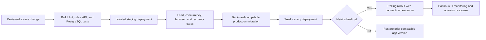
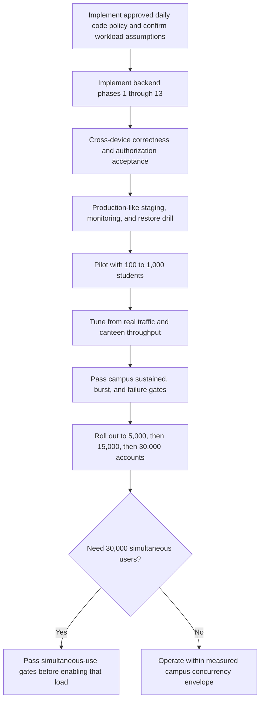

# SpoonAte — plan for 30,000 users

Status: proposed architecture and release criteria, not implemented or benchmarked. Prepared on 2026-10-04.

Use **Supabase-managed PostgreSQL**, the planned **TypeScript/Express/Zod/Prisma backend**, a CDN for the React frontend, and a durable background worker. Start with a modular application and scale it through measured bottlenecks. Supporting 30,000 accounts is different from serving 30,000 people simultaneously; this plan covers both as separate qualification levels.

No architecture can guarantee that every request will succeed. The goal is measurable availability, correct orders, safe retries, and clear recovery when a device, network, provider, or process fails.

This document extends [the backend implementation plan](backend/backend.md) and [the current architecture](architecture.md). Existing product rules remain in force unless an explicitly identified product decision is adopted. The repository currently has a browser-storage prototype, no backend implementation, and no measured production capacity.

## 1. Define the load before buying infrastructure

The following are **planning assumptions**, not predictions or vendor guarantees. Validate them during the pilot using actual sessions, request rates, orders, and canteen throughput.

| Qualification level | Accounts | Simultaneously active users | Order creation target | Purpose |
| --- | ---: | ---: | ---: | --- |
| Pilot | Up to 1,000 | 100–300 | 5 orders/second | Verify real workflows and campus connectivity |
| Campus release | 30,000 | 3,000 | 5 orders/second for 60 minutes; 50/second peak for five minutes; 100/second burst for five minutes | Initial campus-wide capacity target |
| Full simultaneous use | 30,000 | 30,000 | 10 orders/second for 60 minutes; 100/second peak for five minutes; 200/second burst for three minutes | Required if all 30,000 must actively use the app together |

These are accepted order writes, not kitchen fulfillment rates. Also test cart updates, login, staff commands, notifications, and admin queries. A page can make several HTTP requests; a user is not a database connection.

Illustrative traffic calculations:

- 3,000 active users making one ordinary API request every 10 seconds generate **300 requests/second**.
- 30,000 active users at the same rate generate **3,000 requests/second** before status polling.
- One five-second polling request per user adds **600 requests/second** at 3,000 users or **6,000 requests/second** at 30,000 users. Separate order and notification requests double that polling load.
- 30,000 orders spread across 30 minutes average **16.7 orders/second**. A separately tested 50/second five-minute peak provides room for uneven arrival; a short synchronized burst still needs a separate test.

For planning, qualify the campus release at **1,000 total API requests/second sustained and 2,000/second for five minutes**. For full simultaneous use, qualify at **10,000 total API requests/second sustained and 20,000/second for five minutes**, including the selected polling strategy and retries. These are provisional workload envelopes: if the measured client generates more requests, increase the target or reduce that traffic before release.

The daily code policy caps accepted allocations at 46,656 campus-wide per day, including reservations. High write rates are short peak tests, not promises to sustain those rates all day. Registered-user and API read capacity can grow independently of this product limit.

Record a concrete workload mix for each test. Order-write and aggregate HTTP targets must both pass; cached menu reads alone do not prove checkout capacity.

## 2. Reliability and performance targets

These are proposed release targets. Agree them with the operators, then measure them continuously.

| Measure | Proposed target |
| --- | --- |
| Core service availability | At least 99.9% per calendar month; approximately 43 minutes unavailable in a 30-day month |
| Valid API requests under qualified load | Unexpected server failures/timeouts below 0.1%; ordinary valid traffic must not be rate-limited to make this pass |
| Catalog and scoped order reads | p95 below 300 ms; p99 below 1 second |
| Checkout and staff mutations | p95 below 800 ms; p99 below 2 seconds |
| Status visibility | p95 within 10 seconds of commit for connected clients under the selected polling interval |
| Order correctness | Zero lost acknowledged orders, duplicate logical orders, invalid transitions, or unauthorized disclosures in acceptance tests |
| Database disaster recovery | Target RPO at most 5 minutes and RTO at most 60 minutes, subject to purchased backup capabilities and measured restore drills |

API latency is measured at the service boundary from a nearby load generator. Also measure end-to-end campus Wi-Fi/mobile performance; server latency cannot guarantee device performance. Publish p95/p99 per endpoint rather than only an average.

Expected validation, stale-version, and authorization rejections are tracked separately from infrastructure failures. Measure successful legitimate user journeys as well, so a high rate of `429` or conflicts cannot hide an unusable service. Include dependency outages in the availability report.

RPO is the maximum targeted loss of recent data after a disaster. RTO is the targeted recovery time. The zero-loss correctness gate concerns normal execution, concurrency, and process restarts; it does not imply zero data loss under a disaster recovery plan with a nonzero RPO.

## 3. Production architecture



Deploy API replicas across at least two failure domains supported by the hosting platform. Keep the API and database in nearby regions selected after measuring latency from campus. Use a managed container service with health checks, rolling deployment, minimum replica counts, and explicit maximum scaling limits. Select the hosting provider during implementation; this plan does not assume one has already been chosen.

Supabase hosts PostgreSQL; the Express API and workers need their own hosting. Use Supabase as the database first. Retain the backend plan's verified email challenges and database-backed opaque cookie sessions; adopting Supabase Auth later is a separate design change, not a prerequisite for database hosting.

Persist authoritative state only on the server. Browser storage may hold clearly labeled unsent drafts or harmless UI preferences. It must not decide identity, paid status, prices, availability, or whether an order exists.

Production needs a paid database plan with adequate compute, disk, pooling, and backup options. Free projects can pause after low activity. Select resources using staging measurements rather than account count or subscription name. [Supabase production guidance](https://supabase.com/docs/guides/deployment/going-into-prod)

Multiple API replicas protect against an API process failure; they do not remove the primary database failure domain. Verify the database provider's actual recovery/failover capabilities and maintenance behavior. A read replica must not be assumed to provide automatic writable failover. [Supabase read replicas](https://supabase.com/docs/guides/platform/read-replicas)

## 4. Storage and database capacity

| Data | Location and policy |
| --- | --- |
| Profiles, memberships, canteens, menus | PostgreSQL with backend authorization and constraints |
| Carts, orders, immutable item snapshots, status events | PostgreSQL; transactional writes |
| Session hashes, login challenges, idempotency mappings | PostgreSQL; expiry and retention according to the backend plan |
| In-app notifications and delivery work | PostgreSQL notifications and transactional outbox |
| Menu images, if introduced | Object storage; serve resized images through a CDN |
| Logs and metrics | Dedicated observability service with bounded retention and redaction |
| Recovery copies | Provider backups/PITR plus controlled independent exports; separate object backups |

Storage sizing example: 30,000 orders/day at an assumed **5–10 KB per order including items, events, and indexes** yields roughly **150–300 MB/day**, or **55–110 GB/year**, before backup copies, growth overhead, sessions, and other tables. This is a sizing assumption to replace with measurements from representative data. Set disk alerts and agree retention before launch.

Use UUIDs for permanent identity, UTC timestamps, and integer paise. Add database constraints for quantities, foreign keys, idempotency uniqueness, and code reservations. Build indexes around actual filters:

- Student order history: `(student_id, created_at, id)`.
- Canteen work queue: `(canteen_id, status, pickup_at, id)` with ordering matching the query.
- Status history: `(order_id, created_at, id)`.
- Notification list: `(user_id, created_at, id)`; a partial unread index if the query justifies it.
- Session token hash lookup, with separate expiry cleanup indexing.
- Outbox claims: pending state and `available_at`, with stable batch ordering.
- Idempotency: unique `(actor_id, action, key)`.

Use keyset pagination with a maximum page size, such as 50. Return selected fields; never load all campus orders or every event into the browser. Investigate slow queries with execution plans and query statistics on representative data. Maintain vacuum/statistics and monitor table/index growth. Do not introduce partitioning until retention or query measurements justify it.

### Connection budget

Use one reusable Prisma client per API process, with a bounded driver pool. Autoscaling replicas multiplies client connections; never open a new client for each request.

Illustrative application-side budget:

```text
6 API replicas × 10 pool clients = 60
2 workers × 5 pool clients       = 10
deployment/migration reserve     = 10
planned application maximum     = 80 pool clients
```

This is an example, not a Supabase tier recommendation. Account for overlapping old/new replicas during deployment, tooling, and other clients. Supavisor client limits and actual PostgreSQL backend connection limits are different; budget both and leave operational headroom. Pooling does not increase the database's CPU or write throughput. [Supabase pooling limits](https://supabase.com/docs/guides/database/connecting-to-postgres/pooling-and-limits)

Select pooler mode and Prisma settings against the pinned Prisma/driver version. Test prepared statements and interactive transactions with the chosen configuration. Use the supported direct or session-mode connection for migration operations that require it, rather than sending every operation through transaction pooling. [Supabase Prisma guide](https://supabase.com/docs/guides/database/prisma), [connection methods](https://supabase.com/docs/guides/database/connecting-to-postgres)

## 5. Correct orders during simultaneous requests



Implement the transaction and ownership rules already specified in `backend/backend.md`. In particular:

1. Claim an actor/action/idempotency key atomically; verify the payload hash on retries. Concurrent requests with that key create one logical order.
2. Lock the student's cart and revalidate server prices, availability, quantities, and expected cart version. Commit the order, snapshots, history, cart clear, code reservation, and outbox together.
3. Use a consistent lock order, short transactions, bounded statement/lock timeouts, and bounded retries for deadlocks or serialization failures. Never call an email or payment provider while holding transaction locks.
4. Avoid making every checkout acquire an exclusive lock on the same canteen row. Evaluate shared availability locks for checkout and exclusive locks for pause/availability changes. They must conflict correctly while independent checkouts can proceed concurrently; test actual SQL and lock order. If inventory reservations are added, their updates require their own concurrency design. [PostgreSQL locking rules](https://www.postgresql.org/docs/current/explicit-locking.html)
5. Staff changes use expected versions and conditional updates. A repeated command returns its previous result; another command cannot skip a state or collect an order twice.
6. Treat a timeout as an unknown outcome until the original key is queried or retried. Preserve that key across refresh/reconnect; generate a new key only for a new logical checkout.
7. Outbox processing is at least once. Make database notification effects unique by source event and recipient; leases recover crashed workers. External email may duplicate unless the provider supports durable deduplication. Order correctness cannot depend on email delivery.

### Approved product decision: daily three-character codes

**Current limitation:** this is implemented in browser `localStorage`, using the device clock. It cannot guarantee uniqueness across devices or simultaneous submissions. The production backend must use server time and enforce **`UNIQUE(code_day, code)`** in PostgreSQL, retrying collisions within a transaction. That backend enforcement is documented but not implemented yet.

Keep three uppercase alphanumeric characters, unique across the whole campus within each `Asia/Kolkata` calendar day. Each day provides **36³ = 46,656 allocations**; 30,000 allocations/day fit with 16,656 remaining. The namespace renews at campus midnight without deleting history. No code can repeat during its allocation day, even after collection or at another canteen.

Use permanent UUIDs for orders, routes, commands and notification identities. Persist immutable `code_day` alongside the code and enforce `UNIQUE(code_day, code)` transactionally in PostgreSQL. Order cards show the allocation day, ordered items, code and canteen. Collection targets a UUID-selected order after staff compare the dated student card; pickup lookups by code require the allocation day and owning canteen. Admin report searches may list repeated codes across dates/canteens; every result shows its date and collection targets a scoped UUID. Older uncollected orders remain valid after midnight even if their code is reused on a later date.

Reject new allocations when a day exhausts its capacity. Monitor daily capacity and include payment reservations in the budget. For future payments, reserve capacity for an immutable campus day before charging; retain that day through delayed payment and reconciliation. Codes are assigned/exposed only after verified payment. A retry returns the original UUID, code and day.

## 6. Reduce read traffic and status-update load

Serve the built frontend, fonts, and versioned images from a CDN with compression and long-lived immutable asset caching. Cache only public catalog responses at the edge, using short explicit freshness limits and version/ETag revalidation. Never share-cache authenticated carts, orders, sessions, or notifications. Checkout always rechecks the database, even if a cached menu looked available.

The backend plan's five-second visible-page polling is appropriate to test initially, but it cannot be multiplied across every screen without budgeting its cost.

| Client state | Initial behavior to benchmark |
| --- | --- |
| Student tracking an active order | Poll every 5 seconds, jittered; request only changes/current active state |
| Logged-in student with no active order | Poll notifications every 30–60 seconds while visible |
| Hidden student tab | Suspend recurring polling; refresh on focus/reconnect |
| Canteen work queue | Poll every 3–5 seconds while visible; incremental cursor and bounded result set |
| Historical orders | Fetch on navigation and explicit refresh; paginate |
| Admin reports | Refresh every 30–60 seconds; cached/precomputed aggregates where appropriate |

Do not overlap requests; abort stale requests and back off on failures with jitter and `Retry-After`. Share a polling coordinator within the app so several components do not start identical loops. ETags reduce payload size but do not automatically eliminate authentication or database work.

If measured polling violates the traffic or freshness budget, introduce authorized server-sent events or Supabase Realtime as a separately tested phase. Streams notify clients to refresh scoped state; durable database history remains authoritative. Budget simultaneous connections, event fan-out, reconnect storms, and infrastructure limits. Do not broadcast all campus orders to students. Supabase Realtime has plan-specific quotas that must be verified before adopting it. [Realtime limits](https://supabase.com/docs/guides/realtime/limits)

## 7. API scaling, workers, and overload control

Keep replicas stateless: durable sessions and shared rate limits remain in PostgreSQL initially, as planned. Avoid rewriting session `last_seen` on every poll; throttle idle-expiry updates while preserving revocation semantics. Measure session and rate-limit queries as part of load tests. Local process counters cannot enforce a global limit across replicas.

Bound requests, database work, queues, and retries. Reserve capacity for checkout, staff actions, and pickup verification; admin exports and reporting must not consume all resources. Return an actionable temporary-unavailable response when work cannot be admitted rather than letting an unbounded queue exhaust memory. Autoscaling must have a database-aware ceiling and a cooldown; more API replicas can otherwise overload PostgreSQL.

Start with PostgreSQL outbox workers using leased batch claims, bounded concurrency, exponential backoff, and a failed-work queue visible to operators. Keep in-app status updates ahead of bulk or optional email tasks. Track oldest event age as well as queue length. Expired leases become claimable after a crash.

Introduce additional infrastructure only with evidence:

| Measured problem | First action | Optional next step |
| --- | --- | --- |
| API CPU or event-loop saturation | Profile handlers, remove synchronous work, add bounded replicas | Increase per-replica resources if useful |
| Slow indexed database reads/writes | Fix queries and lock contention, then raise database compute/IO capacity | Reassess schema/retention |
| Authentication/rate-limit queries dominate | Reduce unnecessary writes and improve indexes | Shared Redis for selected counters/cache with explicit outage/revocation behavior |
| Admin analytics slow operational queries | Precompute summaries and move exports to workers | Read replica for stale-tolerant reports |
| Outbox workload overwhelms primary | Optimize claims and retention, isolate worker concurrency | Managed queue fed through the transactional outbox |
| Polling dominates load | Reduce and consolidate polls | Authorized streaming after connection/fan-out tests |

Reads immediately following checkout, cart changes, or staff updates go to the primary. Replica lag must not make an acknowledged mutation appear absent. Revisit service boundaries only if a measured need warrants it; 30,000 accounts alone do not require microservices.

## 8. Campus-specific constraints

**Kitchen throughput:** eight canteens cannot be assumed to fulfill the software's order-write target. At 30,000 orders over two hours, the average is 250 orders/minute across campus, or about 31/minute per canteen if evenly distributed. Measure each canteen's staffing, preparation time, and queue capacity. Test an uneven load with most orders directed to one popular canteen.

Existing pause controls remain available and existing orders stay fulfillable. If pickup-slot quotas or preparation-capacity admission are needed, define them as new product requirements and enforce them atomically during checkout. Do not quietly invent cancellation, refund, inventory, or automatic expiry rules. Show accurate queue/availability information before accepting an order.

**Signup verification bursts:** 30,000 student signup emails over 30 minutes require at least 1,000 emails/minute before resends. Subsequent student logins use email/password and do not send OTPs; canteen OTP login and password-reset emails add separate demand. Provision provider quotas and verify institutional-domain delivery before onboarding. Stage invitations rather than sending every student at once. Campus users may share public IP addresses, so combine account/challenge limits with appropriately sized IP limits; verify that legitimate campus traffic is not blocked by a low per-IP quota.

**Campus networks:** test weak Wi-Fi, mobile data, high latency, dropped responses, refresh during checkout, and offline recovery. Display a confirmed order only after durable server success. Keep the student's draft and retry context when the outcome is uncertain.

**Payments:** the first scaled release remains payment-free `TEST` mode. A later paid release must independently qualify payment-provider limits, webhook deduplication, reconciliation, and the accepted-before-payment/preparation-after-verification policy in the backend plan. Never reuse payment-free load results as proof of payment reliability.

## 9. Security boundaries

Use student signup email verification followed by email/password login, canteen email OTP login, server-assigned roles, hashed canteen access codes, protected admin provisioning, HttpOnly/Secure session cookies, origin allowlists, and CSRF protection. Test cross-student and cross-canteen access for every relevant endpoint. Rotate secrets without exposing them in frontend bundles or logs.

The API's database role should have only needed privileges; migration credentials are separate. Keep application tables outside client-exposed schemas where possible, revoke anonymous/authenticated direct access, and disable the Supabase Data API if unused. If tables are exposed through Supabase APIs, enable tested RLS policies. Prisma authorization must not assume browser RLS protects a privileged server connection. Use TLS and provider-supported network restrictions. [Supabase Data API security](https://supabase.com/docs/guides/api/securing-your-api), [production security guidance](https://supabase.com/docs/guides/deployment/going-into-prod)

Limit body size, field lengths, quantities, page sizes, and expensive search operations. Redact passwords, password hashes, session tokens, OTPs, email challenge secrets, and member codes from telemetry. Restrict backup access and document retention for personal data. Protect provider and deployment accounts with MFA.

## 10. Deployment, failures, and recovery



Use separate development, staging, and production databases and credentials. Run migrations once as a controlled job. Prefer expand/migrate/contract schema changes: both old and new app versions must work during rollout and rollback. Delay destructive schema cleanup until the rollback window closes. Do not rely on reversing a destructive migration during an incident.

API replicas need liveness/readiness checks, graceful draining, bounded shutdown, and healthy capacity before old replicas exit. Readiness should stop routing to unhealthy instances without causing an unlimited reconnection storm. Warm minimum capacity before meal peaks; autoscaling may react too late to a synchronized launch.

| Failure | Required behavior |
| --- | --- |
| API replica dies | Other replicas continue; uncertain writes retry with the same key |
| Database unavailable | No local fake orders; clear temporary-unavailable state, bounded retries, incident alert |
| Worker dies | Order remains committed; another worker recovers the lease and delivers durable notifications |
| Email provider unavailable | Existing authenticated order flows continue; queued messages retry; new login clearly shows delay/failure |
| Heavy reporting load | Delay optional reports, preserve operational endpoints |
| Client disconnects | Reconnect retrieves durable order state and notifications |
| Bad deployment | Roll back the compatible application version; preserve committed data |
| Data corruption or accidental deletion | Stop affected writes, restore to an isolated database, validate, reconcile, then switch over deliberately |

Purchase and enable the backup/PITR capabilities needed for the proposed RPO. Measure actual recovery time at realistic data volume; do not claim a 60-minute RTO without a successful drill. Maintain independent encrypted exports and test their restoration. Database backups do not include stored image objects, so back up those separately. [Supabase backup scope and recovery options](https://supabase.com/docs/guides/platform/backups)

After recovery, reconcile orders acknowledged after the chosen recovery point, carts, idempotency mappings, code reservations, status history, and outbox work. Record any unrecoverable orders rather than silently recreating or dropping them. Repeat restore drills before launch and periodically thereafter.

## 11. Observability and operator response

Dashboard API request rate, successful journey rate, errors, p95/p99 latency, replica CPU/memory/event-loop lag, and in-flight work. Track PostgreSQL CPU/IO, disk growth, pool wait time, active connections, slow queries, lock waits/deadlocks, and transaction duration. Track outbox event age, retry count, failed deliveries, and remaining code capacity.

Suggested initial alerts, to tune during the pilot:

- Page the operator for a rapid availability error-budget burn, checkout failures above 1% for five minutes, or a confirmed correctness incident.
- Alert if checkout p95 exceeds 800 ms for ten minutes, pool utilization exceeds 80% for five minutes, or sustained lock waits increase.
- Alert if in-app notification work is older than ten seconds, disk usage exceeds 75%, or storage-growth projections approach provisioned capacity.
- Alert on backup failure, failed restore drills, unusual authorization failures, and pickup-code capacity thresholds.

Assign a primary and backup operator. Provide runbooks for database outage, failed migrations, provider throttling, stuck workers, overloaded canteens, and secret rotation. Run synthetic catalog/login-test/order-flow probes without sending real emails or polluting real kitchen queues. Exclude sensitive fields from traces and avoid user IDs as unbounded metric labels.

## 12. Load-testing and release gates

Add a dedicated `backend/load-tests/` suite when the API exists. k6 is a proposed development-only tool because the current unit/API tests do not generate sustained multi-user traffic. Use thresholds and response correctness checks, not just request volume. [k6 API load-testing guidance](https://grafana.com/docs/k6/latest/testing-guides/api-load-testing/)

Seed representative synthetic data: 30,000 users, all eight canteens, realistic menus, varied cart sizes, notifications, and enough historical orders to model retention. Run both balanced and hot-canteen scenarios. Keep real personal data, kitchen queues, and paid integrations out of these tests. Benchmark production-equivalent resources and network placement; record any differences.

| Test | Load and duration | Evidence required |
| --- | --- | --- |
| Smoke | 10–50 active users, 10 minutes | Full student-to-pickup flow works |
| Campus sustained | 3,000 active users; 1,000 total API requests/second; 5 new orders/second, 60 minutes (18,000 allocations) | Latency, error, correctness, and freshness targets pass |
| Campus peak | 1,000 total API requests/second including 50 new orders/second, five minutes (15,000 allocations) | Short peak write rate passes without violating daily capacity |
| Campus burst | 2,000 total API requests/second including 100 new orders/second, five minutes (30,000 allocations) | Controlled queues and recovery; ordinary valid traffic succeeds |
| Simultaneous-use qualification | 30,000 active users; 10,000 total API requests/second including 10 new orders/second, 60 minutes (36,000 allocations) | Required before claiming all 30,000 can actively use it together |
| Simultaneous-use peak | 10,000 total API requests/second including 100 new orders/second, five minutes (30,000 allocations) | Short peak write rate passes at full active-user load |
| Simultaneous-use burst | 20,000 total API requests/second including 200 new orders/second, three minutes (36,000 allocations) | Same correctness gates and bounded recovery |
| Soak | Qualified API read/update load for four hours; at most 3 new orders/second (43,200 allocations), reduced further for existing same-day allocations | Stable memory, connections, disk, queue age, and latency |
| Concurrency races | Duplicate checkout, double collection, price change, pause race, code collision | One valid committed outcome; no partial order or cart loss |
| Dependency/process failures | Kill API/worker, interrupt DB connectivity, lose responses, throttle email | Durable state and safe retries; no fabricated success |
| Restore and deployment | Restore realistic dataset; migrate, canary, and roll back under load | RPO/RTO evidence and compatibility |
| Campus browser/network acceptance | Separate roles/devices on campus networks | Correct authorization, recovery, and understandable UI states |

Run each allocation-heavy scenario in an independent isolated test database or on separate real campus days. Count seeded same-day orders, setup traffic and payment reservations against the 46,656 limit before starting. Do not delete allocations mid-run or change production code scope to manufacture capacity. Soak extensions must lower the new-order rate or span real midnight boundaries; separately test controlled exhaustion.

Active-user counts and arrival rates need separate test scenarios if one model cannot faithfully achieve both. Generate offered traffic using arrival-rate tests so slow responses do not quietly reduce the request rate and conceal overload. Check generator CPU/network limits and report dropped iterations. Distribute generators for the larger tier if required.

Use fake mail delivery for sustained API tests, plus a separately agreed provider quota/delivery test. Exercise authenticated routes with synthetic preverified accounts and sessions, then test challenge issuance/verification separately. Include realistic cart operations and legitimate staff actions; successful catalog responses alone cannot satisfy an order-flow test.

Check the database after every concurrency/load run: number of logical order keys versus orders, orphan records, invalid state histories, unauthorized effects, duplicate collection, notification duplication, and idempotency response consistency. Model more than 46,656 historical orders across campus dates and separately test same-day exhaustion, midnight reuse, and late pickup; changing benchmark-only code rules would invalidate production evidence.

Store reports with commit, schema version, service sizes, pool budgets, dataset size, traffic mix, cache-hit rate, offered/achieved traffic, generator resources, errors, and p95/p99 latency. Reject the release if correctness fails, even when average latency looks good.

## 13. Build and rollout order



1. **Resolve launch requirements:** confirm concurrency expectations, implement the approved daily pickup-code policy, real menus, canteen capacity, and operator ownership. Track capacity-related product changes separately.
2. **Build the durable backend:** implement the existing phased plan, verified authentication, scoped authorization, transactions, idempotency, outbox, migrations, and API integration. Remove client-side production secrets and browser authority.
3. **Establish production operations:** database and API hosting, pooling budgets, CDN, TLS, email quota, backups, observability, deployment checks, and recovery runbooks.
4. **Run a limited pilot:** invite gradually, inspect campus network behavior, tune request patterns, and measure canteen fulfillment. Pre-scale for announced meal-time usage.
5. **Prove the campus tier:** pass load, correctness, failure, and restore gates. Choose database compute and replica counts from the results; retain headroom and record maximum tested capacity.
6. **Expand enrollment:** move through 5,000, 15,000, and 30,000 accounts only while operational metrics and canteen queues remain healthy. Enrollment is not proof of simultaneous-use capacity.
7. **Qualify full simultaneous use if required:** repeat tests at that workload and fund the necessary capacity before promising it. Requalify after material query, authentication, notification, or payment changes.

No fixed timeline or cloud bill can be credible until pilot traffic and required concurrency are known. Budget database compute/disk/PITR, at least two API replicas, workers, staging, CDN/egress, email volume, observability, and independent backups. Streaming, Redis, queues, or replicas add separate costs only if adopted. Verify current provider prices and quotas during procurement.

## 14. Launch checklist

- [ ] The 30,000-user claim states whether it means accounts, active users, or simultaneous order submissions.
- [ ] The approved campus-day pickup-code policy is enforced by the production schema and backend and verified under concurrency. Frontend prototype and documentation now use daily codes.
- [ ] Shared records and authorization are server-backed; no production demo secrets or local-storage authority remain.
- [ ] Duplicate submissions, pause races, and double pickup pass real PostgreSQL concurrency tests.
- [ ] Normal authorized traffic passes the selected sustained/burst tiers without hidden throttling.
- [ ] Database pool and compute budgets include deployment overlap and operational headroom.
- [ ] Polling/streaming, email quotas, campus shared-IP behavior, and canteen capacity are verified.
- [ ] Operators can observe incidents, retry failed jobs, restore data, and roll back a deployment.
- [ ] Backup drills meet the agreed recovery targets, or the targets/launch scope are explicitly revised.
- [ ] Paid-release behavior is separately designed and qualified before enabling payments.

The release decision depends on measured evidence and operational readiness. This plan supplies targets and gates; it does not certify capacity until those gates pass.

## Authentication and member-management product decisions

Students sign up with name, exact institutional email and password. Email OTP verifies signup ownership before database account activation; students then log in with email/password. Password reset requires a separate email OTP. Persist only salted server-side password hashes, never plaintext browser passwords. Existing verified sessions avoid a new login on every visit.

Canteen members enter email, selected canteen and member access code, then verify an email OTP before session creation. The dashboard lists own-canteen member emails, members with access, distinct members with valid signed-in sessions and per-member session counts. These counts measure valid sessions, not online presence. Use paginated listing and aggregate counts rather than downloading all session records to clients.

Own-canteen members may remove a person's canteen membership. The backend must atomically revoke that membership and all scoped sessions, audit actor/time, and block rejoining or completion of pending email challenges even with the shared code until admin restoration. Enforce membership on every staff API request and serialize login/verification with revocation. Preserve unrelated canteen memberships and existing order history. The implemented browser-local member panel is a prototype; real OTP delivery, cross-device counts and server authorization remain pending.
